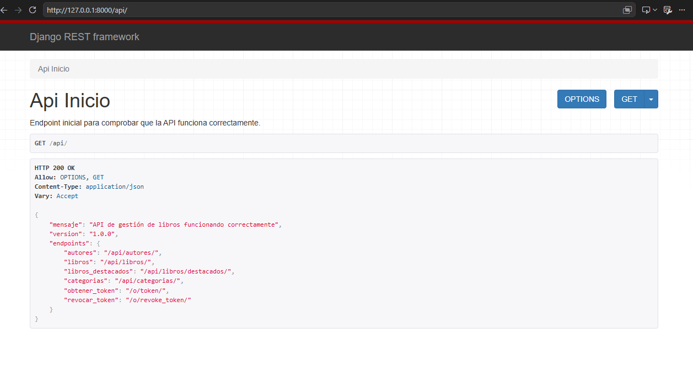
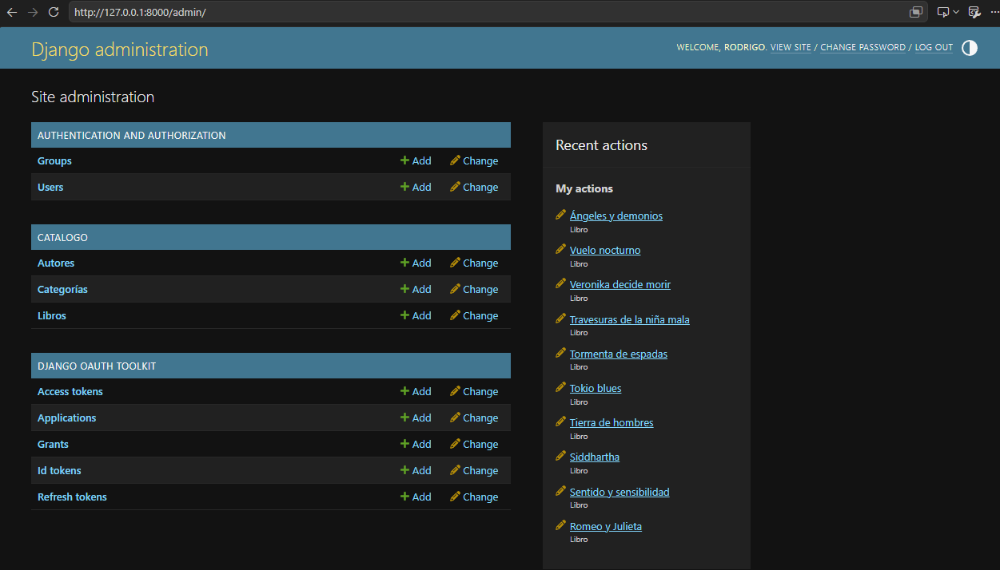
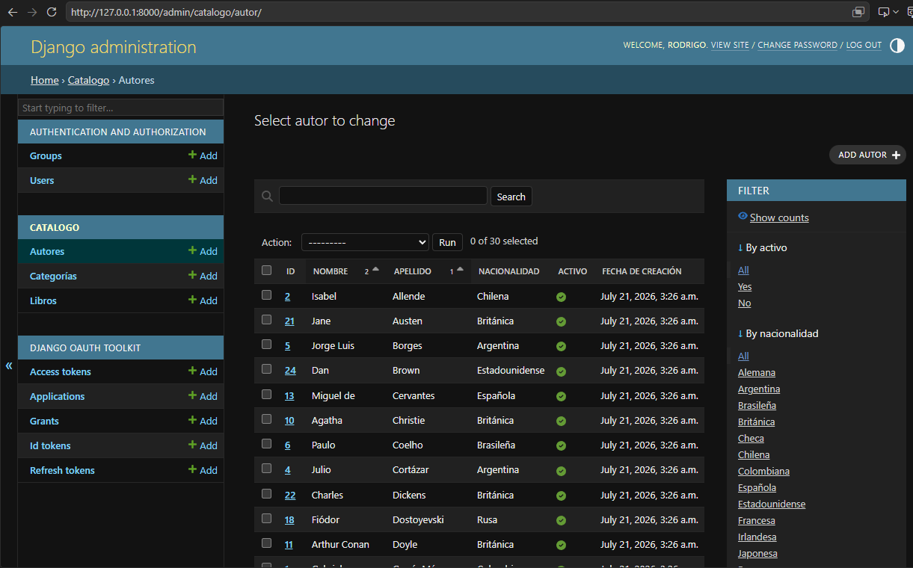
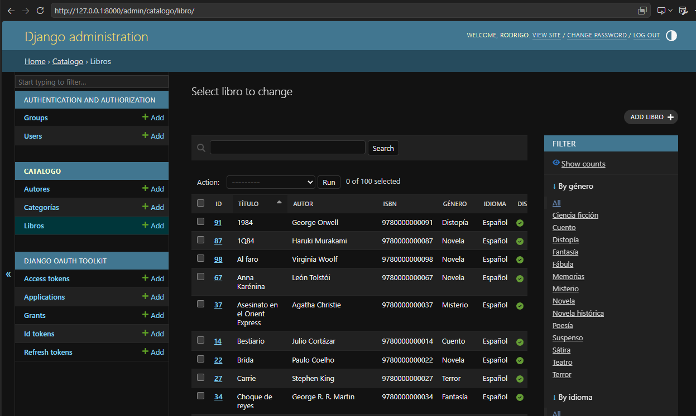
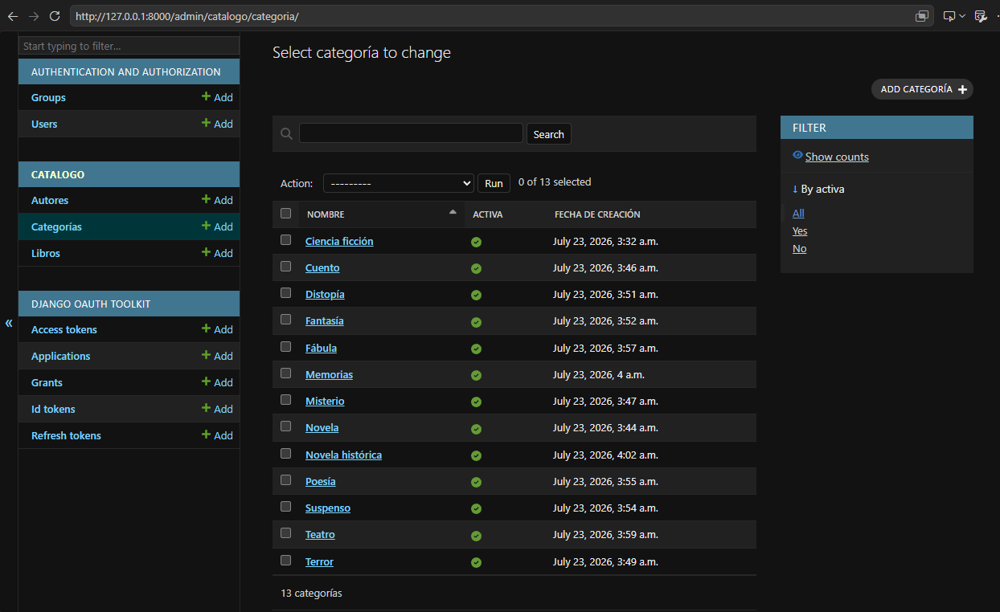
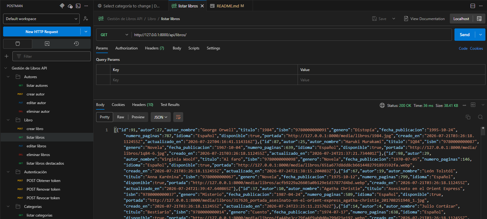

# 📚 Sistema de Gestión de Libros - Backend


---

# Proyecto Final

**Asignatura:** Desarrollo Web

**Carrera:** Ingeniería en Informática

**Universidad:** Universidad Internacional SEK (UISEK)

---

## Descripción General

El presente proyecto corresponde al desarrollo del **Backend** del Sistema de Gestión de Libros, una aplicación web Full Stack diseñada para administrar información relacionada con autores, libros y categorías mediante una API REST desarrollada con Django REST Framework.

El sistema implementa una arquitectura Cliente-Servidor, donde el Backend expone servicios REST consumidos por un cliente desarrollado en React.

Además de las operaciones CRUD, la aplicación incorpora autenticación mediante OAuth2, control de permisos, validaciones de datos, carga de imágenes, búsqueda, filtros y ordenamiento de información.

---

# Tabla de Contenidos

- Introducción
- Objetivos
- Alcance del Proyecto
- Tecnologías Utilizadas
- Arquitectura del Sistema
- Arquitectura del Backend
- Estructura del Proyecto
- Modelo de Datos
- API REST
- Endpoints
- Autenticación OAuth2
- Permisos
- Instalación
- Configuración
- Variables de Entorno
- Validaciones
- Seguridad
- Mejoras Futuras
- Conclusiones

---

# Introducción

El desarrollo de aplicaciones web modernas requiere la separación entre la lógica del negocio y la interfaz de usuario.

Siguiendo este enfoque, el presente proyecto implementa el Backend del Sistema de Gestión de Libros utilizando Django REST Framework, permitiendo que cualquier cliente compatible con HTTP pueda consumir los servicios proporcionados por la API.

La aplicación fue diseñada siguiendo principios de arquitectura REST, promoviendo una separación clara entre los datos, la lógica de negocio y la presentación.

El Backend administra toda la información relacionada con:

- Autores
- Libros
- Categorías
- Imágenes
- Usuarios autenticados

Asimismo, implementa mecanismos de autenticación mediante OAuth2 y permisos personalizados que garantizan la seguridad del sistema.

# Objetivos

## Objetivo General

Desarrollar una API REST robusta, segura y escalable para la administración de un catálogo de libros, implementando buenas prácticas de desarrollo con Django REST Framework.

## Objetivos Específicos

- Diseñar una arquitectura Cliente-Servidor.
- Implementar operaciones CRUD para autores, libros y categorías.
- Gestionar relaciones entre entidades mediante modelos relacionales.
- Implementar autenticación mediante OAuth2.
- Controlar el acceso a los recursos mediante permisos personalizados.
- Validar la información ingresada por los usuarios.
- Permitir la carga y administración de imágenes.
- Facilitar la integración con un cliente desarrollado en React.

# Alcance

El Backend desarrollado proporciona todos los servicios necesarios para el funcionamiento del Sistema de Gestión de Libros.

Entre sus principales responsabilidades se encuentran:

- Gestión de autores.
- Gestión de libros.
- Gestión de categorías.
- Administración de imágenes.
- Exposición de una API REST.
- Control de autenticación.
- Control de permisos.
- Validación de datos.
- Administración mediante Django Admin.

El sistema fue desarrollado utilizando una arquitectura modular que facilita futuras ampliaciones, tales como la incorporación de préstamos, favoritos, historial de lectura o calificaciones.

# CAPITULO 2

# Tecnologías Utilizadas

El Backend del Sistema de Gestión de Libros fue desarrollado utilizando tecnologías modernas del ecosistema Python, seleccionadas por su estabilidad, escalabilidad y amplia adopción en el desarrollo de aplicaciones web empresariales.

La siguiente tabla resume las principales herramientas utilizadas durante el desarrollo del proyecto.

| Tecnología | Versión | Descripción |
|------------|----------|-------------|
| Python | 3.x | Lenguaje principal de programación utilizado para el desarrollo del Backend. |
| Django | 5.x | Framework web de alto nivel que proporciona una arquitectura robusta basada en el patrón MTV (Model-Template-View). |
| Django REST Framework | 3.x | Framework utilizado para la construcción de la API REST, facilitando la serialización de datos, autenticación, permisos y manejo de solicitudes HTTP. |
| Django OAuth Toolkit | 3.x | Implementación del protocolo OAuth2 para la autenticación segura de usuarios. |
| SQLite | 3 | Motor de base de datos utilizado durante el desarrollo del proyecto. |
| Pillow | Última | Biblioteca utilizada para la manipulación y almacenamiento de imágenes (portadas y fotografías). |
| Postman | Última | Herramienta utilizada para probar y documentar los endpoints de la API REST. |
| Git | Última | Sistema de control de versiones distribuido utilizado para el seguimiento de cambios del proyecto. |
| GitHub | - | Plataforma utilizada para alojar el código fuente y gestionar el repositorio. |
| Visual Studio Code | Última | Entorno de desarrollo integrado (IDE) utilizado durante la implementación del proyecto. |

---

# Justificación de las Tecnologías

## Python

Python fue seleccionado como lenguaje principal debido a su sintaxis clara, facilidad de mantenimiento y amplio ecosistema de bibliotecas para el desarrollo web.

Entre sus principales ventajas destacan:

- Código limpio y legible.
- Desarrollo rápido.
- Gran comunidad de soporte.
- Excelente integración con Django.

---

## Django

Django constituye el núcleo del Backend.

Este framework implementa múltiples funcionalidades listas para producción, entre ellas:

- ORM para acceso a base de datos.
- Panel administrativo.
- Sistema de autenticación.
- Manejo de migraciones.
- Seguridad integrada.
- Gestión de archivos multimedia.
- Validación automática de modelos.

Su arquitectura favorece la reutilización del código y el mantenimiento del sistema.

---

## Django REST Framework

Django REST Framework (DRF) fue utilizado para construir todos los servicios REST del proyecto.

Entre las funcionalidades implementadas se encuentran:

- Serialización de objetos.
- ViewSets.
- Routers automáticos.
- Validaciones personalizadas.
- Permisos.
- Filtros.
- Búsquedas.
- Ordenamiento.
- Respuestas HTTP estructuradas.

Gracias a DRF fue posible exponer la información del sistema mediante una API moderna basada en JSON.

---

## Django OAuth Toolkit

Para proteger las operaciones de escritura del sistema se implementó OAuth2.

Este protocolo permite:

- Obtener Access Tokens.
- Revocar Tokens.
- Autenticar usuarios.
- Restringir operaciones sensibles.

Las operaciones de consulta permanecen públicas mientras que las operaciones de creación, modificación y eliminación requieren autenticación.

---

## SQLite

Durante el desarrollo se empleó SQLite debido a:

- Facilidad de configuración.
- No requiere instalación adicional.
- Integración nativa con Django.
- Excelente desempeño para proyectos académicos.

No obstante, la arquitectura permite migrar fácilmente hacia PostgreSQL o MySQL.

---

## Pillow

La biblioteca Pillow permitió almacenar imágenes correspondientes a:

- Fotografías de autores.
- Portadas de libros.

Estas imágenes son administradas mediante ImageField y almacenadas dentro del directorio Media del proyecto.

---

# Arquitectura General del Sistema

El sistema implementa una arquitectura Cliente – Servidor.

En este modelo el Frontend consume los servicios publicados por el Backend mediante solicitudes HTTP.

```
                   Usuario
                      │
                      ▼
       Navegador Web (Google Chrome)
                      │
                      ▼
              React + Material UI
                      │
          Solicitudes HTTP (Axios)
                      │
                      ▼
            Django REST Framework
                      │
          ┌───────────┴────────────┐
          ▼                        ▼
      OAuth2                 Base de Datos
          │                     SQLite
          │                        │
          └───────────┬────────────┘
                      ▼
                 Archivos Media
```


El flujo general de funcionamiento de la aplicación puede resumirse en los siguientes pasos:

1. El usuario interactúa con la interfaz desarrollada en React.

2. React envía solicitudes HTTP hacia la API REST utilizando Axios.

3. Django REST Framework recibe la solicitud.

4. Se valida la autenticación y los permisos correspondientes.

5. Los ViewSets procesan la solicitud.

6. Los Serializers validan y transforman la información.

7. Los Models interactúan con la base de datos SQLite.

8. Django genera una respuesta en formato JSON.

9. React procesa la respuesta y actualiza la interfaz del usuario.

Este flujo garantiza una clara separación entre la lógica de negocio y la capa de presentación.


# El Backend fue organizado siguiendo una arquitectura por capas que facilita el mantenimiento del código y promueve la reutilización de componentes.


```text
                 Cliente HTTP

                      │

                      ▼

                 URL Routing

                      │

                      ▼

                  ViewSets

                      │

                      ▼

                 Serializers

                      │

                      ▼

                    Models

                      │

                      ▼

                  Base de Datos
```

# La arquitectura utilizada presenta múltiples ventajas:

- Separación de responsabilidades.
- Bajo acoplamiento entre módulos.
- Fácil mantenimiento.
- Escalabilidad.
- Reutilización del código.
- Integración sencilla con aplicaciones móviles o clientes web.
- Seguridad mediante autenticación y permisos.
- Facilidad para incorporar nuevos módulos sin modificar la estructura existente.


# CAPITULO 3 


# Estructura del Proyecto

El Backend fue organizado siguiendo la estructura recomendada por Django, separando las responsabilidades de cada módulo para facilitar el mantenimiento, escalabilidad y reutilización del código.

La estructura principal del proyecto es la siguiente:

```
backend/
│
├── catalogo/
│   ├── migrations/
│   ├── fixtures/
│   ├── admin.py
│   ├── apps.py
│   ├── models.py
│   ├── permissions.py
│   ├── serializers.py
│   ├── tests.py
│   ├── urls.py
│   └── views.py
│
├── config/
│
├── media/
│   ├── autores/
│   ├── libros/
│   └── categorias/
│
├── manage.py
└── requirements.txt
```

Cada uno de estos componentes cumple una función específica dentro de la arquitectura del sistema.

---

# Aplicación catalogo

La aplicación **catalogo** concentra toda la lógica de negocio del proyecto.

En ella se implementan:

- Modelos de datos
- Serializadores
- API REST
- Validaciones
- Permisos
- Configuración del panel administrativo
- Endpoints

Esta organización permite mantener una separación clara entre la lógica de negocio y la configuración general del proyecto.

---

# Modelos del Sistema (models.py)

El archivo `models.py` define la estructura de la base de datos mediante el ORM de Django.

En este proyecto se implementaron tres entidades principales:

- Autor
- Libro
- Categoria

Estas entidades representan la información administrada por la aplicación.

---

# Modelo Autor

El modelo **Autor** almacena la información correspondiente a los escritores registrados en el sistema.

Cada autor posee información biográfica y puede estar asociado a múltiples libros.

## Información almacenada

- Nombre
- Apellido
- Nacionalidad
- Fecha de nacimiento
- Biografía
- Estado (activo/inactivo)
- Fotografía
- Fecha de creación
- Fecha de actualización

### Características implementadas

✔ Fotografía opcional mediante `ImageField`.

✔ Fechas automáticas de creación y actualización.

✔ Ordenamiento automático por apellido y nombre.

✔ Relación uno a muchos con el modelo Libro.

La relación se implementó utilizando el parámetro:

- `related_name="libros"`

lo cual permite consultar fácilmente todos los libros pertenecientes a un autor.

---

# Modelo Libro

El modelo **Libro** representa cada obra literaria registrada dentro del sistema.

Cada libro pertenece obligatoriamente a un autor.

## Información almacenada

- Autor
- Título
- ISBN
- Género
- Fecha de publicación
- Número de páginas
- Idioma
- Estado de disponibilidad
- Portada
- Fecha de creación
- Fecha de actualización

### Características implementadas

✔ ISBN único.

✔ Validación de número mínimo de páginas.

✔ Portada opcional.

✔ Idioma configurable.

✔ Estado disponible/no disponible.

---

## Relación entre Autor y Libro

La relación entre ambas entidades fue implementada mediante una llave foránea (`ForeignKey`).

Un autor puede tener múltiples libros.

Cada libro pertenece únicamente a un autor.

Para preservar la integridad de la información se utilizó:

```
on_delete = PROTECT
```

Esto impide eliminar un autor cuando existen libros asociados, evitando registros huérfanos dentro de la base de datos.

---

# Modelo Categoria

El modelo Categoria fue incorporado para administrar las categorías visibles en el Frontend.

Cada categoría contiene:

- Nombre
- Imagen
- Estado activo
- Fecha de creación
- Fecha de actualización

### Características implementadas

✔ Nombre único.

✔ Imagen opcional.

✔ Activación y desactivación de categorías.

✔ Ordenamiento alfabético.

Las imágenes se almacenan dentro del directorio:

```
media/categorias/
```

---

# Panel Administrativo (admin.py)

El archivo `admin.py` registra los modelos dentro del panel administrativo de Django.

Cada modelo fue personalizado para facilitar la administración de la información.

## AutorAdmin

Se implementaron las siguientes funcionalidades:

- listado de autores
- búsqueda por nombre
- búsqueda por apellido
- búsqueda por nacionalidad
- filtros por estado
- ordenamiento automático
- fechas de solo lectura

---

## LibroAdmin

Se configuró el panel administrativo para permitir:

- listado de libros
- búsqueda por título
- búsqueda por ISBN
- búsqueda por autor
- filtros por género
- filtros por idioma
- filtros por disponibilidad

Además se implementó:

```
autocomplete_fields
```

permitiendo buscar autores fácilmente cuando se registra un nuevo libro.

---

## CategoriaAdmin

Permite administrar las categorías del sistema mediante:

- listado
- búsqueda
- filtros por estado

Esto facilita el mantenimiento del catálogo mostrado en el Frontend.

---

# Gestión de Archivos Multimedia

El Backend incorpora soporte para almacenamiento de imágenes.

Se utilizan tres directorios independientes:

```
media/

autores/

libros/

categorias/
```

Esta organización permite mantener separados los distintos recursos gráficos utilizados por la aplicación.

Las imágenes son administradas mediante campos `ImageField` del ORM de Django.

---

# Beneficios de la estructura implementada

La organización utilizada ofrece diversas ventajas:

- Código modular.
- Fácil mantenimiento.
- Escalabilidad.
- Separación de responsabilidades.
- Reutilización de componentes.
- Integración sencilla con nuevos módulos.
- Compatibilidad con futuras bases de datos como PostgreSQL o MySQL.

# CAPITULO 4

# API REST y Lógica de Negocio

La API REST constituye el núcleo del Backend del Sistema de Gestión de Libros. Su implementación se realizó utilizando **Django REST Framework (DRF)**, el cual proporciona una estructura robusta para la creación de servicios web siguiendo la arquitectura REST.

La API fue diseñada para ofrecer una separación clara entre la lógica de negocio y la capa de presentación, permitiendo que cualquier cliente HTTP (como React, una aplicación móvil o Postman) pueda consumir la información de manera segura y estandarizada.

Durante el desarrollo se implementaron los siguientes componentes principales:

- Serializers
- ViewSets
- Permisos personalizados
- Routers automáticos
- Endpoints públicos
- Endpoints protegidos
- Filtros
- Búsquedas
- Ordenamiento
- Validaciones personalizadas

---

# Serializadores (serializers.py)

Los **Serializers** son responsables de transformar los objetos del ORM de Django en respuestas JSON que pueden ser consumidas por el Frontend. Además, validan la información recibida antes de almacenarla en la base de datos.

En este proyecto se implementaron cuatro serializadores.

---

# LibroResumenSerializer

Este serializador tiene como finalidad mostrar una versión resumida de los libros asociados a un autor.

Se utiliza dentro del `AutorSerializer` para evitar enviar información innecesaria y reducir el tamaño de las respuestas.

La información incluida corresponde a:

- Identificador
- Título
- ISBN
- Género
- Estado de disponibilidad
- Portada

Esta estrategia mejora el rendimiento de la API y evita consultas adicionales desde el Frontend.

---

# AutorSerializer

El `AutorSerializer` administra toda la información relacionada con los autores registrados en el sistema.

Además de serializar los campos del modelo, incorpora información calculada dinámicamente mediante `SerializerMethodField`.

## Información incluida

- Datos personales del autor.
- Fotografía.
- Biografía.
- Estado activo.
- Lista resumida de libros.
- Nombre completo.
- Total de libros publicados.

---

## Campos calculados

Para mejorar la experiencia del usuario se implementaron dos campos adicionales.

### Nombre completo

En lugar de construir el nombre completo en el Frontend, el Backend devuelve este dato ya preparado.

Esto reduce lógica en el cliente y mantiene un único punto de cálculo.

---

### Total de libros

El Backend calcula automáticamente el número de libros asociados a cada autor.

Cuando la consulta proviene de un queryset anotado mediante `annotate()`, se reutiliza dicho valor para mejorar el rendimiento.

En caso contrario, el sistema realiza el conteo utilizando la relación con el modelo Libro.

---

## Validaciones implementadas

El serializer incorpora validaciones específicas para garantizar la calidad de los datos almacenados.

### Nombre

- Eliminación de espacios innecesarios.
- Longitud mínima de dos caracteres.
- Conversión automática al formato título.

---

### Apellido

- Eliminación de espacios.
- Longitud mínima.
- Conversión automática al formato título.

---

### Fecha de nacimiento

Se impide registrar fechas futuras.

Esto garantiza la consistencia de la información biográfica.

---

### Fotografía

Antes de almacenar una imagen el sistema verifica:

- Formato JPG.
- Formato PNG.
- Formato WEBP.

Además controla que el tamaño del archivo no supere los 5 MB.

Estas validaciones reducen el riesgo de almacenar archivos no válidos y optimizan el uso del almacenamiento.

---

# LibroSerializer

Este serializer administra toda la información correspondiente a los libros.

Incluye tanto los datos propios del libro como información relacionada con su autor.

---

## Autor del libro

En lugar de mostrar únicamente el identificador del autor, el serializer incorpora un campo calculado denominado:

- autor_nombre

De esta manera el Frontend recibe directamente el nombre del autor sin necesidad de realizar consultas adicionales.

---

## Validaciones implementadas

Durante el registro de un libro se verifican diferentes reglas de negocio.

Entre ellas:

- Longitud mínima del título.
- Eliminación de espacios innecesarios.
- Validación de fechas.
- Validación del número de páginas.
- Validación de formatos de imagen.
- Control del tamaño de la portada.

Estas validaciones permiten mantener la integridad de la información registrada.

---

# CategoriaSerializer

El serializer de categorías expone la información necesaria para que el Frontend construya el catálogo visual de categorías.

Cada categoría devuelve:

- Nombre
- Imagen
- Estado
- Fechas de registro

Las imágenes son enviadas utilizando la URL generada automáticamente por Django.

---

# ViewSets (views.py)

Los ViewSets concentran toda la lógica de negocio de la API.

Su función principal consiste en recibir las solicitudes HTTP, ejecutar las operaciones correspondientes sobre la base de datos y devolver respuestas estructuradas en formato JSON.

En este proyecto se implementaron dos ViewSets principales.

---

# AutorViewSet

Este componente administra completamente el recurso Autor.

Entre las operaciones soportadas se encuentran:

- Listar autores.
- Consultar un autor.
- Registrar autores.
- Actualizar información.
- Eliminar autores.

---

## Optimización de consultas

Para mejorar el rendimiento de la API se emplearon diferentes estrategias.

### annotate()

Se utiliza para calcular el total de libros asociados a cada autor directamente desde la base de datos.

Esto evita realizar múltiples consultas individuales.

---

### prefetch_related()

Permite cargar todos los libros relacionados con un autor mediante una única consulta adicional.

Gracias a ello se elimina el problema conocido como N+1 Queries.

---

## Búsquedas

La API permite buscar autores utilizando distintos criterios.

Entre ellos:

- Nombre.
- Apellido.
- Nacionalidad.

---

## Ordenamiento

Los resultados pueden ordenarse dinámicamente por:

- Nombre.
- Apellido.
- Nacionalidad.
- Fecha de creación.
- Total de libros.

---

## Filtros

También se implementó un filtro por estado.

Ejemplo:

```
GET /api/autores/?activo=true
```

o

```
GET /api/autores/?activo=false
```

---

## Eliminación protegida

Antes de eliminar un autor se verifica que no existan libros relacionados.

Si existen registros asociados, la API devuelve un mensaje indicando que la operación no puede realizarse.

Esta decisión evita inconsistencias en la base de datos.

---

# LibroViewSet

Este ViewSet administra completamente el recurso Libro.

Permite:

- Consultar libros.
- Registrar nuevos libros.
- Modificar información.
- Eliminar registros.

---

## Optimización

Para reducir consultas innecesarias se implementó:

- select_related()

Esta técnica carga automáticamente la información del autor relacionada con cada libro.

---

## Filtros disponibles

Los libros pueden filtrarse mediante distintos parámetros.

- Autor
- Género
- Idioma
- Disponibilidad

Esto facilita la construcción de búsquedas avanzadas desde el Frontend.

---

## Búsquedas

La API permite localizar libros mediante:

- Título.
- ISBN.
- Género.
- Nombre del autor.
- Apellido del autor.

---

## Ordenamiento

Los resultados pueden ordenarse por:

- Título.
- Fecha de publicación.
- Número de páginas.
- Fecha de creación.

---

## Endpoint personalizado

Además del CRUD tradicional se implementó un endpoint adicional denominado:

```
GET /api/libros/destacados/
```

Este endpoint devuelve únicamente una selección de libros disponibles para ser mostrados en la página principal del sistema.

Su implementación permite desacoplar la lógica del Frontend respecto a la selección de libros destacados.

---

# Endpoint de Categorías

Las categorías se publican mediante un endpoint específico.

```
GET /api/categorias/
```

Este servicio únicamente devuelve las categorías activas, ordenadas alfabéticamente.

Gracias a ello el Frontend puede construir dinámicamente el catálogo de categorías sin necesidad de mantener información estática.

---

# Endpoint de Inicio

La API incorpora un endpoint principal cuya finalidad es verificar el correcto funcionamiento del servicio.

Este endpoint devuelve:

- Mensaje de bienvenida.
- Versión de la API.
- Relación de endpoints disponibles.

Su objetivo es facilitar las pruebas y documentar los recursos publicados.

---

# Sistema de Permisos

La seguridad del sistema fue implementada mediante un permiso personalizado denominado:

```
LecturaPublicaEscrituraAutenticada
```

Su funcionamiento es sencillo:

- Las operaciones de lectura son públicas.
- Las operaciones de escritura requieren autenticación.

En consecuencia:

| Método HTTP | Requiere autenticación |
|-------------|------------------------|
| GET | No |
| HEAD | No |
| OPTIONS | No |
| POST | Sí |
| PUT | Sí |
| PATCH | Sí |
| DELETE | Sí |

Este enfoque permite que cualquier visitante pueda consultar el catálogo de libros, mientras que únicamente los usuarios autenticados pueden modificar la información.

---

# Organización de las URLs

La publicación de los endpoints se realizó utilizando `DefaultRouter`.

Esta herramienta genera automáticamente todas las rutas necesarias para cada ViewSet, reduciendo código repetitivo y facilitando el mantenimiento del proyecto.

Además del router se definieron endpoints independientes para:

- Inicio de la API.
- Categorías.

La organización final mantiene una estructura limpia, escalable y sencilla de extender con nuevos recursos.


# CAPITULO 5

# Instalación y Configuración del Backend

El Backend fue desarrollado utilizando Python y Django. Para su correcta ejecución es necesario preparar previamente el entorno de desarrollo, instalar las dependencias del proyecto y realizar la configuración inicial de la base de datos.

En esta sección se describen todos los pasos necesarios para ejecutar la aplicación desde cero.

---

# Requisitos Previos

Antes de iniciar la instalación se recomienda verificar que el equipo cuente con los siguientes componentes:

| Software | Versión recomendada |
|-----------|---------------------|
| Python | 3.11 o superior |
| Git | Última versión |
| Visual Studio Code | Última versión |
| pip | Incluido con Python |
| Navegador Web | Google Chrome o Microsoft Edge |

Para comprobar la instalación de Python se puede ejecutar:

```bash
python --version
```

También es recomendable verificar la versión de pip:

```bash
pip --version
```

---

# Clonar el Repositorio

El primer paso consiste en clonar el repositorio desde GitHub.

```bash
git clone https://github.com/USUARIO/NOMBRE-REPOSITORIO.git
```

Ingresar al directorio del proyecto:

```bash
cd gestion-libros-backend
```

> **Nota:** Reemplazar `USUARIO/NOMBRE-REPOSITORIO` por la dirección real del repositorio en GitHub.

---

# Crear un Entorno Virtual

Para aislar las dependencias del proyecto se recomienda utilizar un entorno virtual.

### Windows

```bash
python -m venv venv
```

Activar el entorno virtual:

```bash
venv\Scripts\activate
```

### Linux / macOS

```bash
python3 -m venv venv

source venv/bin/activate
```

Una vez activado, el nombre del entorno virtual aparecerá al inicio de la consola.

---

# Instalar las Dependencias

Con el entorno virtual activo instalar todas las librerías necesarias.

```bash
pip install -r requirements.txt
```

Entre las principales dependencias utilizadas se encuentran:

- Django
- Django REST Framework
- Django OAuth Toolkit
- Pillow

---

# Aplicar las Migraciones

El proyecto utiliza el sistema de migraciones de Django para construir automáticamente la base de datos.

Ejecutar:

```bash
python manage.py migrate
```

Este comando crea todas las tablas necesarias dentro de SQLite.

---

# Crear el Superusuario

Para acceder al panel administrativo de Django es necesario crear un usuario administrador.

```bash
python manage.py createsuperuser
```

El sistema solicitará:

- Nombre de usuario
- Correo electrónico
- Contraseña

Una vez finalizado el proceso el administrador podrá acceder al panel mediante:

```
http://127.0.0.1:8000/admin/
```

---

# Ejecutar el Servidor

Con la base de datos preparada se puede iniciar el servidor de desarrollo.

```bash
python manage.py runserver
```

La consola mostrará un mensaje similar al siguiente:

```
Starting development server at:

http://127.0.0.1:8000/
```

A partir de este momento la API REST estará disponible para recibir solicitudes.

---

# Configuración de Archivos Multimedia

El proyecto utiliza el sistema Media de Django para almacenar imágenes correspondientes a:

- Fotografías de autores.
- Portadas de libros.
- Imágenes de categorías.

Estas imágenes son almacenadas dentro del directorio:

```
media/
```

Durante el desarrollo, Django sirve automáticamente estos archivos cuando el servidor se encuentra en modo DEBUG.

---

# Configuración de Django REST Framework

La configuración principal de DRF se encuentra definida en el archivo:

```
config/settings.py
```

Entre las configuraciones implementadas destacan:

- Autenticación mediante OAuth2.
- Permisos por defecto.
- Renderización de respuestas JSON.
- Configuración de parsers.
- Configuración de Media.
- Configuración de Static Files.

Estas opciones permiten mantener una configuración centralizada para toda la API.

---

# Configuración de OAuth2

Para proteger las operaciones de escritura se implementó el protocolo OAuth2 utilizando **Django OAuth Toolkit**.

El flujo de autenticación es el siguiente:

1. El usuario inicia sesión desde el Frontend.
2. El Backend valida las credenciales.
3. Se genera un Access Token.
4. El Frontend almacena el token.
5. Las solicitudes protegidas incluyen el token en la cabecera Authorization.
6. El Backend valida el token antes de permitir cualquier operación de escritura.

Gracias a este mecanismo únicamente los usuarios autenticados pueden registrar, modificar o eliminar información.

---

# Base de Datos

Durante el desarrollo se utilizó SQLite como motor de base de datos.

Las principales razones para esta elección fueron:

- Fácil configuración.
- Integración nativa con Django.
- No requiere instalación adicional.
- Adecuada para proyectos académicos y prototipos.

La arquitectura implementada permite migrar fácilmente hacia PostgreSQL o MySQL sin modificar la lógica del sistema.

---

# Verificación del Funcionamiento

Una vez iniciado el servidor se recomienda comprobar que la API responde correctamente.

Los principales recursos disponibles son:

| Recurso | URL |
|----------|-----|
| Inicio de la API | http://127.0.0.1:8000/api/ |
| Autores | http://127.0.0.1:8000/api/autores/ |
| Libros | http://127.0.0.1:8000/api/libros/ |
| Categorías | http://127.0.0.1:8000/api/categorias/ |
| Panel Administrativo | http://127.0.0.1:8000/admin/ |

Si todos estos recursos responden correctamente significa que la instalación fue exitosa.

---

# Pruebas de la API

Durante el desarrollo se utilizaron diferentes herramientas para verificar el correcto funcionamiento de los servicios REST.

Las pruebas realizadas incluyeron:

- Consulta de recursos mediante GET.
- Registro de nuevos autores.
- Registro de libros.
- Actualización de información.
- Eliminación de registros.
- Validación de permisos.
- Pruebas de autenticación OAuth2.
- Verificación de carga de imágenes.
- Pruebas de filtros y búsquedas.

Estas pruebas permitieron garantizar la estabilidad y correcto funcionamiento de la aplicación antes de su integración con el Frontend.

---

# Consideraciones para Producción

Aunque el proyecto fue desarrollado con fines académicos, la estructura implementada permite su despliegue en un entorno de producción.

Para ello sería recomendable:

- Migrar la base de datos a PostgreSQL.
- Desactivar el modo DEBUG.
- Configurar un servidor web como Nginx.
- Utilizar Gunicorn como servidor WSGI.
- Configurar HTTPS.
- Almacenar las variables sensibles mediante variables de entorno.
- Servir los archivos Media y Static desde un servicio especializado.

Estas mejoras permitirían utilizar el sistema en un entorno real con mayores niveles de seguridad y rendimiento.

# CAPITULO 6

# Documentación de la API REST

El Backend expone una API REST desarrollada con Django REST Framework que permite la administración de autores, libros y categorías.

Todas las respuestas son enviadas en formato **JSON**, facilitando la integración con aplicaciones web, móviles o cualquier cliente HTTP.

La API implementa operaciones CRUD completas, autenticación mediante OAuth2, permisos personalizados, validaciones de datos y manejo de archivos multimedia.

---

# URL Base

Durante el desarrollo la API se ejecuta sobre la siguiente dirección:

```
http://127.0.0.1:8000/api/
```

Todos los recursos parten desde esta URL.

---

# Recursos Disponibles

| Recurso | Endpoint |
|----------|----------|
| Inicio | `/api/` |
| Autores | `/api/autores/` |
| Libros | `/api/libros/` |
| Libros Destacados | `/api/libros/destacados/` |
| Categorías | `/api/categorias/` |

---

# Métodos HTTP Utilizados

La API implementa los siguientes métodos HTTP.

| Método | Descripción |
|----------|-------------|
| GET | Consultar información |
| POST | Registrar información |
| PUT | Actualizar completamente un recurso |
| PATCH | Actualización parcial |
| DELETE | Eliminar un recurso |

---

# Sistema de Autenticación

La autenticación fue implementada mediante OAuth2 utilizando Django OAuth Toolkit.

Los recursos públicos pueden consultarse libremente.

Las operaciones que modifican la información requieren un Access Token válido.

El token debe enviarse mediante la cabecera:

```
Authorization: Bearer ACCESS_TOKEN
```

---

# Estados HTTP Utilizados

La API devuelve códigos HTTP estándar para indicar el resultado de cada operación.

| Código | Significado |
|---------|-------------|
| 200 | Solicitud realizada correctamente |
| 201 | Recurso creado correctamente |
| 204 | Eliminación exitosa |
| 400 | Error de validación |
| 401 | Usuario no autenticado |
| 403 | Acceso denegado |
| 404 | Recurso no encontrado |
| 409 | Conflicto de integridad |

---

# Endpoint de Inicio

## GET /api/

Este endpoint permite verificar que la API se encuentra funcionando correctamente.

### Ejemplo

```
GET /api/
```

### Respuesta

```json
{
    "mensaje": "API de gestión de libros funcionando correctamente",
    "version": "1.0.0",
    "endpoints": {
        "autores": "/api/autores/",
        "libros": "/api/libros/",
        "categorias": "/api/categorias/"
    }
}
```

---

# Recurso Autores

## Obtener todos los autores

```
GET /api/autores/
```

### Descripción

Devuelve la lista completa de autores registrados.

Cada autor incluye:

- Información personal.
- Fotografía.
- Biografía.
- Total de libros.
- Libros asociados.

---

### Respuesta

```json
[
  {
    "id": 1,
    "nombre": "Gabriel",
    "apellido": "García Márquez",
    "nombre_completo": "Gabriel García Márquez",
    "nacionalidad": "Colombiana",
    "total_libros": 4
  }
]
```

---

## Obtener un autor

```
GET /api/autores/{id}/
```

Obtiene la información completa de un autor específico.

---

## Registrar un autor

```
POST /api/autores/
```

**Requiere autenticación.**

### Ejemplo

```json
{
    "nombre":"Julio",
    "apellido":"Verne",
    "nacionalidad":"Francesa"
}
```

---

## Actualizar un autor

```
PUT /api/autores/{id}/
```

Permite modificar toda la información del autor.

---

## Actualización parcial

```
PATCH /api/autores/{id}/
```

Permite modificar únicamente determinados campos.

---

## Eliminar un autor

```
DELETE /api/autores/{id}/
```

El sistema impide eliminar autores que tengan libros asociados.

En dicho caso devuelve:

```
409 Conflict
```

---

# Recurso Libros

## Obtener libros

```
GET /api/libros/
```

Devuelve todos los libros registrados.

---

## Registrar libro

```
POST /api/libros/
```

Requiere autenticación.

Permite registrar:

- Autor
- Título
- ISBN
- Género
- Idioma
- Portada

---

## Obtener libro

```
GET /api/libros/{id}/
```

Obtiene el detalle completo del libro.

---

## Actualizar libro

```
PUT /api/libros/{id}/
```

Actualiza completamente un libro.

---

## Actualización parcial

```
PATCH /api/libros/{id}/
```

Actualiza únicamente algunos campos.

---

## Eliminar libro

```
DELETE /api/libros/{id}/
```

Elimina un libro del catálogo.

---

# Endpoint Libros Destacados

```
GET /api/libros/destacados/
```

Este endpoint fue desarrollado específicamente para el Frontend.

Su función consiste en devolver únicamente los libros disponibles que serán mostrados en la página principal.

De esta manera el Frontend no necesita implementar lógica adicional para seleccionar los libros destacados.

---

# Endpoint Categorías

```
GET /api/categorias/
```

Devuelve todas las categorías activas ordenadas alfabéticamente.

Cada categoría contiene:

- Nombre.
- Imagen.
- Estado.
- Fechas.

---

# Parámetros de Búsqueda

La API incorpora mecanismos de búsqueda mediante SearchFilter.

## Autores

```
GET /api/autores/?search=Gabriel
```

Permite buscar por:

- Nombre
- Apellido
- Nacionalidad

---

## Libros

```
GET /api/libros/?search=Cien años
```

Permite buscar por:

- Título
- ISBN
- Género
- Nombre del autor
- Apellido del autor

---

# Parámetros de Filtro

Los ViewSets incorporan filtros para facilitar consultas específicas.

## Libros

```
GET /api/libros/?genero=Novela
```

```
GET /api/libros/?autor=2
```

```
GET /api/libros/?idioma=Español
```

```
GET /api/libros/?disponible=true
```

---

## Autores

```
GET /api/autores/?activo=true
```

---

# Parámetros de Ordenamiento

Los resultados pueden ordenarse dinámicamente.

Ejemplo:

```
GET /api/libros/?ordering=titulo
```

```
GET /api/libros/?ordering=-fecha_publicacion
```

```
GET /api/autores/?ordering=apellido
```

---

# Validaciones Implementadas

El Backend incorpora validaciones automáticas antes de almacenar la información.

Entre ellas:

- Longitud mínima del nombre.
- Longitud mínima del apellido.
- Fecha de nacimiento válida.
- ISBN único.
- Número mínimo de páginas.
- Tamaño máximo de imágenes.
- Formatos permitidos para fotografías.
- Formatos permitidos para portadas.

Estas validaciones son ejecutadas por los Serializers antes de guardar cualquier registro.

---

# Manejo de Errores

Cuando ocurre un error la API devuelve una respuesta JSON con información descriptiva.

Ejemplo:

```json
{
    "detalle": "No se puede eliminar el autor porque tiene libros relacionados."
}
```

Este comportamiento facilita que el Frontend pueda mostrar mensajes claros al usuario.

---

# Integración con el Frontend

El Backend fue desarrollado pensando en una integración sencilla con aplicaciones cliente.

Las respuestas JSON mantienen una estructura uniforme y consistente, lo que facilita su consumo desde React mediante Axios.

Asimismo, el uso de OAuth2 permite proteger las operaciones sensibles sin afectar el acceso público a la información del catálogo.

---

# Buenas Prácticas Implementadas

Durante el desarrollo del Backend se aplicaron diversas buenas prácticas de ingeniería de software, entre ellas:

- Arquitectura REST.
- Separación de responsabilidades.
- Uso de ViewSets.
- Uso de Serializers.
- Permisos personalizados.
- Optimización de consultas mediante `select_related`, `prefetch_related` y `annotate`.
- Validaciones en la capa de serialización.
- Uso de códigos HTTP estándar.
- Organización modular del proyecto.
- Preparación para futuras ampliaciones del sistema.

# CAPITULO 7

# Capturas del Sistema

A continuación se presentan algunas capturas representativas del funcionamiento del Backend durante el desarrollo del proyecto.

> **Nota:** Reemplazar las siguientes imágenes por las capturas reales del sistema.

---

## Página principal de la API



La página principal permite verificar el correcto funcionamiento del servicio y muestra los recursos principales disponibles.

---

## Panel Administrativo de Django



El panel administrativo fue utilizado para la administración de:

- Usuarios
- Autores
- Libros
- Categorías

Además permite gestionar imágenes y realizar operaciones CRUD de manera visual.

---

## Administración de Autores



Desde este módulo es posible:

- Registrar nuevos autores.
- Editar información.
- Gestionar fotografías.
- Consultar libros asociados.

---

## Administración de Libros



El módulo de libros permite administrar toda la información bibliográfica del sistema.

Incluye:

- Autor
- ISBN
- Género
- Idioma
- Portada
- Estado de disponibilidad

---

## Administración de Categorías



Las categorías pueden administrarse desde el panel de Django.

Cada categoría puede tener:

- Nombre
- Imagen
- Estado

Estas categorías son consumidas posteriormente por el Frontend.

---

## Pruebas con Postman



Durante el desarrollo se realizaron pruebas utilizando Postman para verificar:

- Operaciones CRUD.
- Respuestas HTTP.
- Autenticación OAuth2.
- Validaciones.
- Carga de imágenes.
- Manejo de errores.

---

# Funcionalidades Implementadas

El Backend desarrollado incorpora las siguientes funcionalidades:

## Gestión de Autores

- Registro de autores.
- Consulta individual.
- Consulta general.
- Edición.
- Eliminación protegida.
- Fotografía del autor.

---

## Gestión de Libros

- Registro de libros.
- Consulta individual.
- Consulta general.
- Actualización.
- Eliminación.
- Portadas.
- Relación con autores.

---

## Gestión de Categorías

- Consulta de categorías.
- Administración mediante Django Admin.
- Imágenes para categorías.
- Activación y desactivación.

---

## API REST

Se implementó una API REST completa que permite:

- Consultas públicas.
- Operaciones autenticadas.
- Búsquedas.
- Filtros.
- Ordenamiento.
- Endpoints personalizados.

---

## Seguridad

El sistema incorpora diferentes mecanismos de seguridad.

Entre ellos:

- OAuth2.
- Permisos personalizados.
- Validaciones de datos.
- Protección de relaciones mediante `PROTECT`.
- Restricción de formatos de imágenes.
- Restricción del tamaño de archivos.

---

# Decisiones de Diseño

Durante el desarrollo del proyecto se tomaron diversas decisiones técnicas con el propósito de construir una aplicación mantenible, escalable y fácil de integrar con otros clientes.

Entre las principales decisiones adoptadas se encuentran:

- Utilizar Django REST Framework para la construcción de la API.
- Separar la lógica de negocio mediante ViewSets.
- Centralizar las validaciones en los Serializers.
- Utilizar relaciones mediante ForeignKey para mantener la integridad de los datos.
- Implementar permisos personalizados para controlar el acceso a los recursos.
- Utilizar OAuth2 como mecanismo de autenticación.
- Organizar el proyecto siguiendo la estructura recomendada por Django.

Estas decisiones permitieron desarrollar un Backend modular, reutilizable y preparado para futuras ampliaciones.

---

# Posibles Mejoras Futuras

Aunque el proyecto cumple completamente con los objetivos planteados, existen diversas funcionalidades que podrían incorporarse en futuras versiones.

Entre ellas:

- Sistema de favoritos.
- Historial de lectura por usuario.
- Calificaciones de libros.
- Comentarios.
- Gestión de préstamos.
- Dashboard estadístico.
- Reportes en PDF.
- Notificaciones.
- Integración con servicios de almacenamiento en la nube.
- Implementación de Docker para despliegue.
- Integración continua mediante GitHub Actions.

Estas mejoras permitirían convertir el sistema en una plataforma más completa para la administración de bibliotecas digitales.

---

# Conclusiones

El desarrollo del Backend permitió aplicar de manera práctica los conocimientos adquiridos durante la asignatura de Desarrollo Web.

A lo largo del proyecto se implementaron tecnologías modernas para la construcción de servicios REST, aplicando principios de diseño orientados a la reutilización del código, la separación de responsabilidades y la seguridad de la información.

La utilización de Django REST Framework facilitó la construcción de una API robusta, mientras que la integración de OAuth2 permitió controlar el acceso a los recursos protegidos.

Asimismo, la organización modular del proyecto facilita futuras ampliaciones sin afectar la estructura existente.

Como resultado se obtuvo un Backend completamente funcional, preparado para integrarse con aplicaciones cliente desarrolladas en React u otras tecnologías compatibles con servicios REST.

---

# Autores

**Proyecto:** Sistema de Gestión de Libros

**Asignatura:** Desarrollo Web

**Carrera:** Ingeniería en Informática

**Universidad:** Universidad Internacional SEK (UISEK)

### Integrantes

- Rodrigo Castillo
- Ariel Velasquez 

---

# Repositorio

Backend

```
https://github.com/RodrigoC1820/gestion-libros-backend.git
```

Frontend

```
https://github.com/RodrigoC1820/gestion-libros-frontend.git
```

---

# Estado del Proyecto

**Versión:** 1.0

**Estado:** Finalizado

**Última actualización:** Julio 2026

